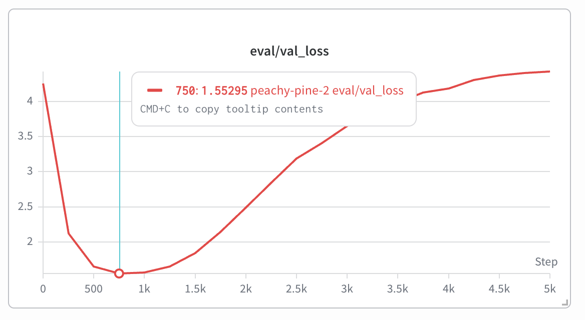
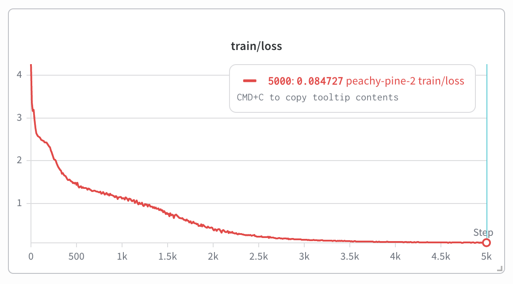
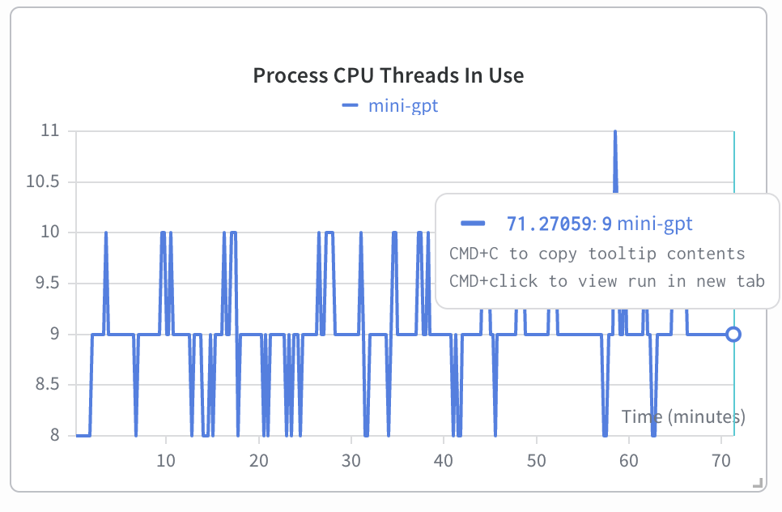
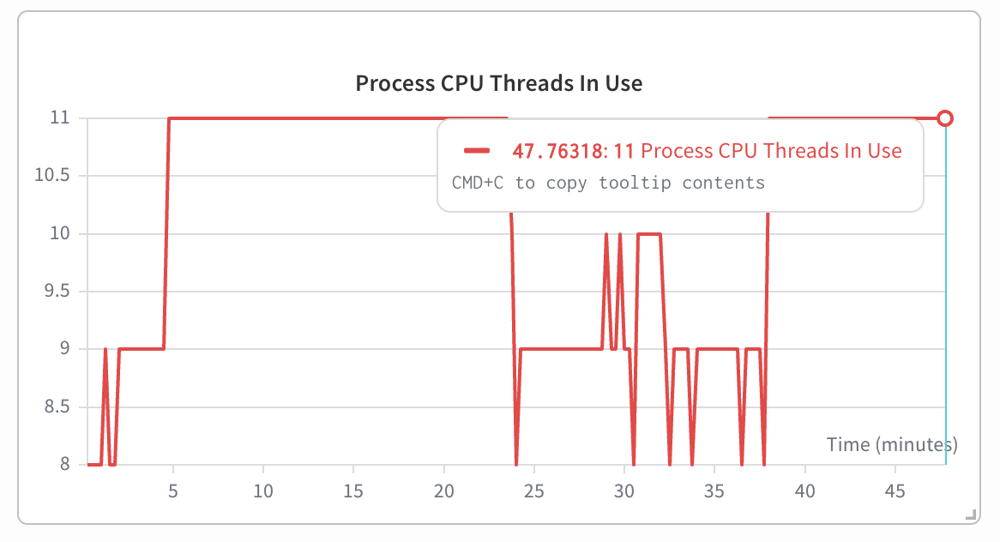

# `nanoGPT_mlx2`

Update of Vithu Thangarasa's [MLX port](https://github.com/vithursant/nanoGPT_mlx) of Karpathy's [nanoGPT](https://github.com/karpathy/nanoGPT). 

Trains a nanoGPT model from scratch using Apple's native machine learning framework, [MLX](https://github.com/ml-explore/mlx). Requires Apple Silicon (M1/M2/M3/M4) — no CUDA drivers or external GPU setup needed.

#### Dependencies:
- [`mlx`](https://ml-explore.github.io/mlx/build/html/index.html)
- [`numpy`](https://numpy.org/install/)
-  `datasets` for OpenWebText from huggingface datasets 
-  `tqdm` progress bars in OWT data preparation
-  `tiktoken` OpenAI's fast BPE code
-  `wandb` experiment tracking

## Update Status

The original port successfully executed training runs, but inference output was plagued by repetition loops regardless of hyperparameter configuration. Initial training on both the Shakespeare and OWT datasets using GPT-2's BPE would rapidly collapse into a single token repetition loop:

```
$ python sample.py --init_from=resume --out_dir=gpt2_shakespeare_pretrain --start="Romeo, Romeo, wherefore art thou" --num_samples=1

Overriding: out_dir = gpt2_shakespeare_pretrain
Overriding: start = Romeo, Romeo, wherefore art thou
Overriding: num_samples = 1
Loaded GPT-2 with 49.354 M parameters
Romeo, Romeo, wherefore art thou be be be be be be be be be be be be be be be be be be be be be be be be be be be be be be be be be be be be be be be be be be be be be be be be be be be be be be be be be be be be be be be ...
```

To address the repetition issue, I opted to add the configuration for character-level tokenization of the Shakespeare dataset in order to work with a more tractable model size for debug/testing. I trained a model with an identical configuration using Karpathy's base `nanoGPT` repository, making only minor modifications for `mps` enablement on my Mac M3, and ran comparison tests with output generated from Vithu's `nanoGPT_mlx` port (`convert_pytorch_to_mlx.py` script used for conversion). Notes on debugging steps are included in [`layer_testing_debug.md`](layer_testing_debug.md). Following the identification of the root issue and retraining, the model successfully output text with the expected coherence and Shakespearian tone:

```
$ python sample.py --out_dir=out-shakespeare-char --init_from=resume
Overriding: out_dir = out-shakespeare-char
Overriding: init_from = resume
Loaded GPT-2 with 10.770 M parameters
Using character-level encoding (vocab_size=65)


GLOUCESTER:
Ay, my cousin the heart amonused: set there beheld,
So gracious unfewn'd, he beheld; fear in this babe,
And he hath still flied augation, our great conference;
And the cruption of Warwick, now we knew it.

GLOUCESTER:
So, sir, good, to pardon 

Make assue to be foot.
...
```

## Training

The `shakespeare_char` dataset achieved its best validation loss quickly, at around 750 iterations before overfitting. The run was allowed to continue in order to test MPS vs MLX performance.

<table>
<tr>
<td align="center"><b>Validation Loss</b><br></td>
<td align="center"><b>Training Loss</b><br></td>
</tr>
</table>


## MLX vs MPS performance

Running on a Mac M3, the `shakespeare_char` training was run for 5000 iterations using the same transformer architecture as Karpathy's `nanoGPT` defaults. The only changes made to `nanoGPT` were to enable `mps` instead of `cuda` for PyTorch, and all hyperparameters were held constant for comparison.

The base `nanoGPT` run completed 5000 iterations in 71.27 minutes, while the MLX native `nanoGPT` completed 5000 iterations in 47.76 minutes, a 33% speed up with no additional configuration required.

<table>
<tr>
<td align="center"><b>nanoGPT (PyTorch MPS) — 71.27 min</b><br></td>
<td align="center"><b>nanoGPT_mlx (MLX) — 47.76 min</b><br></td>
</tr>
</table>


## Setup

```bash
pip install -r requirements.txt
wandb login
```

Any config variable can be overridden from the command line, e.g.:
```bash
python train.py configs/train_shakespeare_char.py --batch_size=32 --num_iters=1000
```

## Simple Start

### Shakespeare (character-level)
This matches Karpathy's `train_shakespeare_char.py` config for direct comparison. Uses character-level tokenization (vocab_size=65) instead of GPT-2 BPE.

```bash
python data/shakespeare_char/prepare.py
python train.py configs/train_shakespeare_char.py --init_from=scratch
python sample.py --init_from=resume --out_dir=out-shakespeare-char
```

### Shakespeare (BPE)
Uses GPT-2 BPE tokenization via tiktoken (vocab_size=50304). Fewer tokens but larger vocabulary.

```bash
python data/shakespeare/prepare.py
python train.py configs/train_gpt2_shakespeare.py --init_from=scratch
python sample.py --init_from=resume --out_dir=gpt2_shakespeare_pretrain
```

## OpenWebText
To train a GPT-2 model on OpenWebText similar to nanoGPT, first prepare the dataset:
```bash
python data/openwebtext/prepare.py
```
Then, train a 124M GPT-2 model on your Mac GPU:
```bash
python train.py configs/train_gpt2_owt.py
```

## Testing output
`sample.py` loads the best validation checkpoint by default and automatically detects character-level vs BPE models by checking for a `meta.pkl` with a matching vocab_size in `data/`.

Training auto-resumes from the last checkpoint when using `--init_from=resume` (the default). Use `--init_from=scratch` to start fresh.


## Converting PyTorch checkpoints
Use `convert_pytorch_to_mlx.py` to load a Karpathy nanoGPT checkpoint into the MLX model code:
```bash
python convert_pytorch_to_mlx.py path/to/ckpt.pt --out_dir=converted_model
python sample.py --init_from=resume --out_dir=converted_model
```

## Modifications so far
- **Inverted causal attention mask (root cause)** — `mx.where` argument order was backwards in `CausalSelfAttention`, causing the model to attend to future tokens and mask out valid past tokens. This broke both training and inference. The fix was swapping `mx.where(mask == 0, att, -1e9)` to `mx.where(mask == 0, -1e9, att)`. Verified by comparing forward pass logits against PyTorch (max diff: 0.000005, correlation: 1.0).
- `mx.where` with `float('-inf')` produces NaN — use `-1e9` as a workaround for large negative values
- `mx.random.categorical` can get stuck in repetition loops due to MLX lazy evaluation / random state not advancing — currently using numpy for sampling as a workaround
- `@mx.compile` can cache initial model weights, preventing parameter updates from being seen — avoid using on eval functions during training
- `tiktoken` cache lives in `/tmp` and is cleared on reboot — set `TIKTOKEN_CACHE_DIR` to a persistent location to avoid re-downloading
- Padded vocab tokens (50257-50303) have no tiktoken mapping and cause pyo3 panic on decode — filter with `[t for t in tokens if t < enc.n_vocab]`
- Character-level models require a `meta.pkl` file (generated by `data/shakespeare_char/prepare.py`) containing `stoi`/`itos` mappings — `sample.py` auto-detects this by matching vocab_size
- Substituted Weight-and-Biases for training monitoring rather than tensorboard

## Acknowledgements
[Andrej Karpathy](https://github.com/karpathy) for nanoGPT - https://github.com/karpathy/nanogpt
[Vithu Thangarasa](https://github.com/vithursant) for the initial nanoGPT_mlx work - https://github.com/vithursant/nanoGPT_mlx

